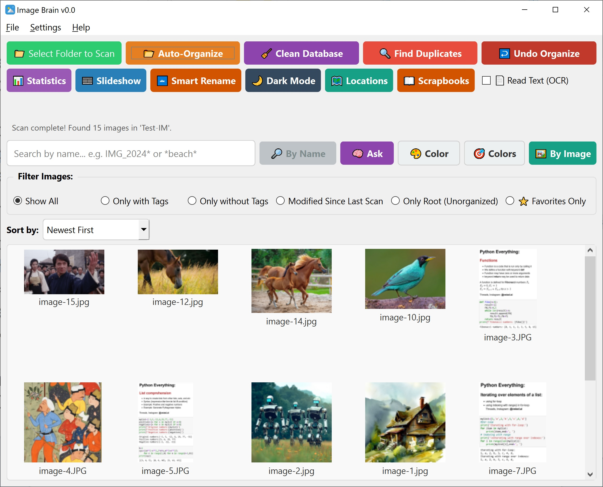
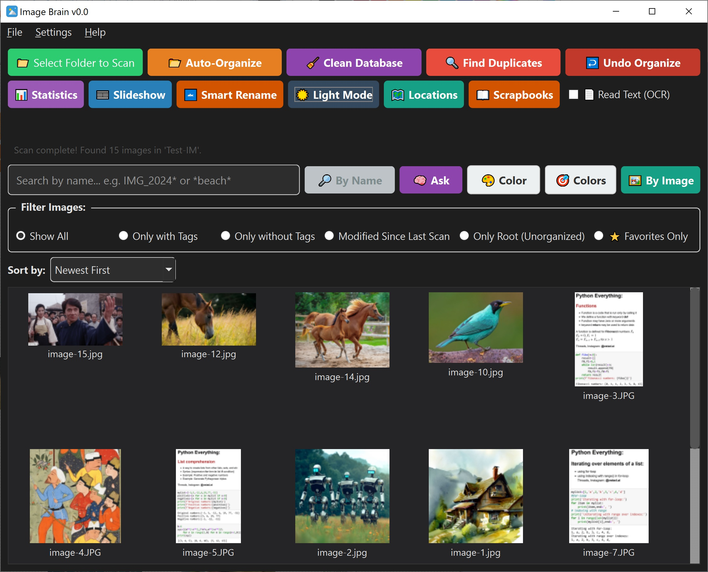

#  ImageBrain v0.0

**A bilingual, intelligent, and 100% offline home for your memories.**

ImageBrain is a powerful, privacy-first AI photo organizer that understands your images in both **English** and **Persian**. It runs entirely on your device—your photos never leave your computer.

---

<table>
  <tr>

<td>
Figure 1: A snapshot of the app: Image Brain, version 0.0.</td>
    
<td>
Figure 2: A snapshot of the the app in Dark Mode.</td>

  </tr>
</table>

---

## ✨ Features

### 🧠 The Bilingual Brain
* **Smart Search (Ask):** Search your photos using natural language in English or Persian (e.g., "dog on the beach" or "غروب دریا").
* **Deep Vision:** Find photos that *look* similar, even if they have no tags.
* **Contextual Understanding:** Remembers seasons, years, weekends, and events.

### 👁️ The Eyes (AI Engines)
* **Object & Scene Detection:** Automatically identifies objects, scenes, and faces.
* **OCR (Read Text):** Extracts text from documents, screenshots, and signs (supports Persian & English).
* **Color Intelligence:** Search by dominant colors or pick colors directly from a photo.

### 🛠️ The Tools
* **Auto-Organize:** Sort your library into folders by tags, dates, or visual similarity.
* **Smart Rename:** Automatically rename messy files based on their content and dates.
* **Find Duplicates:** Detect exact copies and visual look-alikes.
* **Scrapbooks & Slideshows:** Curate your favorite memories and watch them play.

### 🔒 The Privacy Promise
* **100% Offline:** No cloud, no tracking, no hidden internet connections. 
* **Your Data is Yours:** All AI processing happens locally on your machine.

---

## 📥 How to Download & Install

Because ImageBrain is a rich, fully offline AI application, its total size is around **578 MB**. To ensure smooth downloading over unstable or slow internet connections, we have split the installation archive into **10 small chunks**.

### Step 1: Download the Files
Please download **all 11 files** (10 parts + 1 header) from the links below, and place them in the **same folder** on your computer.

### Step 2: Download the Stitching Tool
Download the **FileProcessor.exe** tool. This is a tiny utility designed to stitch the 10 parts back together into a single archive.

### Step 3: Stitch and Extract
1. Open **FileProcessor.exe**.
2. Go to the **Merge File** tab.
3. Click **Load Header** and select the `ImageBrain_header.txt` file you downloaded.
4. Click **Merge**. The tool will seamlessly glue the 10 parts into a single `ImageBrain_v0.0.rar` archive.
5. Extract the `.rar` file using WinRAR or 7-Zip.

### Step 4: Run the App
Inside the extracted folder, simply double-click **`ImageBrain.exe`** to launch your new AI brain!

---

## 🔗 Download Links

**⚠️ Important:** You must download *all* of the following files and keep them in the same directory.

| File Name | Description | Download Link |
| :--- | :--- | :--- |
| **Part 1** | Chunk 1 of 10 | [Download Part 1](https://drive.google.com/file/d/1fgBsBEsWjtws6jnBeWSRUN84zVLsuS9X/view?usp=sharing) |
| **Part 2** | Chunk 2 of 10 | [Download Part 2](https://drive.google.com/file/d/116NgHIshGiCD4mbI8k6b9tJyimcWJare/view?usp=sharing) |
| **Part 3** | Chunk 3 of 10 | [Download Part 3](https://drive.google.com/file/d/1Pf1OBhfHtxRSTVBmo3_aC-HlXp4_2f_3/view?usp=sharing) |
| **Part 4** | Chunk 4 of 10 | [Download Part 4](https://drive.google.com/file/d/1L4_nLjjVj2mM5Hgc92CTwULm0vBirZAU/view?usp=sharing) |
| **Part 5** | Chunk 5 of 10 | [Download Part 5](https://drive.google.com/file/d/1XVZkSaUs-caj6II6GbB79xGml6B2PxZc/view?usp=sharing) |
| **Part 6** | Chunk 6 of 10 | [Download Part 6](https://drive.google.com/file/d/1tpFtOTucisw7V7UMzZixm_x9zpUAdXYK/view?usp=sharing) |
| **Part 7** | Chunk 7 of 10 | [Download Part 7](https://drive.google.com/file/d/1-7cqlvWCkAnkbSWqVE1puQyqhNqNjNJ9/view?usp=sharing) |
| **Part 8** | Chunk 8 of 10 | [Download Part 8](https://drive.google.com/file/d/16rPPS_t43zwFwm3suTiqoJuI9bMc6kiQ/view?usp=sharing) |
| **Part 9** | Chunk 9 of 10 | [Download Part 9](https://drive.google.com/file/d/1KMgMYzmExVgx5uPOo8kbJFgRxVpF1aOU/view?usp=sharing) |
| **Part 10** | Chunk 10 of 10 | [Download Part 10](https://drive.google.com/file/d/1RuSS3m6NMwpti3JGiGsshaHOSKzjSrAr/view?usp=sharing) |
| **Header File** | Required for merging | [Download Header](https://drive.google.com/file/d/1nT9WHUUDf_RuxpcOthIOw3roPkSphP08/view?usp=sharing) |
| **FileProcessor.exe** | The stitching tool | [Download Tool](https://drive.google.com/file/d/1Mn1uiKniA-BSPYpRKYu6wufnGQGtvrmV/view?usp=sharing) |

---

## 🖥️ System Requirements

* **OS:** Windows 10 or 11 (64-bit)
* **Disk Space:** ~1 GB free space
* **RAM:** 4 GB minimum (8 GB recommended for faster scanning)
* **No Internet Required:** Once installed, it runs completely offline.

---

## 🌟 Support & Community

Building a fully offline, bilingual AI brain from scratch is a labor of love. If you enjoy using ImageBrain, please consider supporting us!

* ⭐ **Star this Repository** if you find it useful!
* 🐛 **Report Bugs:** Found a glitch? Open an Issue so we can squash it.
*  **Suggest Features:** Have an idea for the next version? Let us know in the Discussions tab.

---

*Built with ❤️ and a lot of coffee. Your memories deserve a brilliant mind.*